### 👋 Sobre mim · About me

<table>
<tr>
<td width="50%" valign="top">

**PT** — Desenvolvedor full-stack @ **14Mob**, Brasil. Construo apps TypeScript de ponta a ponta: fluxos com IA, editores 3D no browser e ferramentas financeiras.

</td>
<td width="50%" valign="top">

**EN** — Full-stack developer @ **14Mob**, Brazil. I build end-to-end TypeScript apps: AI-powered flows, in-browser 3D editors, and personal finance tools.

</td>
</tr>
</table>

---

### 📊 GitHub Stats

  
  

---

### 🛠 Tech Stack

  
  
  
  

---

### ⭐ Featured Projects · Projetos em destaque

<table>
<tr>
<td width="33%" valign="top">

#### 🔌 Conduit

🇧🇷 Builder visual de fluxos conversacionais com IA (canvas de nós)

🇺🇸 Visual conversational flow builder with AI agents (node canvas)

React · Vite · Fastify · Drizzle · PostgreSQL · React Flow

</td>
<td width="33%" valign="top">

#### 🏠 DreamPlanner

🇧🇷 Hub de planejamento de apartamento — finanças, checklist, documentos e editor 3D.

🇺🇸 Apartment planning hub — finances, checklist, documents, and 3D editor.

Next.js · Three.js · Drizzle · Neon · Capacitor

</td>
<td width="33%" valign="top">

#### 💰 FinTrack

🇧🇷 Organizador financeiro pessoal fullstack — ganhos, gastos, cartões e reservas.

🇺🇸 Fullstack personal finance organizer — income, expenses, cards, and savings.

React · Vite · Express · Prisma · Supabase

</td>
</tr>
</table>

---

### 🐍 Contribution Graph

  

---

### 🔗 Connect · Conecte-se

  
  
  

