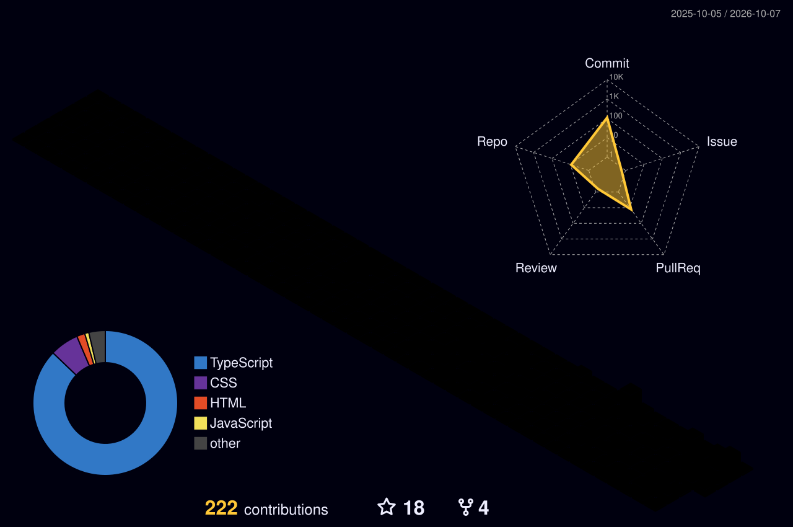

  <a href="#about"><b>whoami</b></a> &nbsp;·&nbsp;
  <a href="#projects"><b>projetos / projects</b></a> &nbsp;·&nbsp;
  <a href="#activity"><b>atividade / activity</b></a> &nbsp;·&nbsp;
  <a href="#stack"><b>stack</b></a> &nbsp;·&nbsp;
  <a href="#connect"><b>contato / connect</b></a>

### `>_` whoami

<table>
<tr>
<td width="50%" valign="top">

🇧🇷 Desenvolvedor full-stack na **14Mob**. Construo apps TypeScript de ponta a ponta — da UI ao banco — com foco em **agentes de IA**, **3D no browser** e **ferramentas financeiras**. Gosto de interfaces que respondem rápido e de APIs que o compilador consegue provar.

</td>
<td width="50%" valign="top">

🇺🇸 Full-stack developer at **14Mob**. I build end-to-end TypeScript apps — from UI to database — focused on **AI agents**, **in-browser 3D** and **finance tools**. I like interfaces that feel instant and APIs the compiler can prove.

</td>
</tr>
</table>

### `✦` Projetos em destaque · Featured projects

💡 Clique em um card para abrir · Click a card to open it

### `◷` Atividade · Activity

<picture>
  <source media="(prefers-color-scheme: dark)" srcset="./assets/3d/contrib-dark.svg" />
  <source media="(prefers-color-scheme: light)" srcset="./assets/3d/contrib-light.svg" />
  
</picture>

<picture>
  <source media="(prefers-color-scheme: dark)" srcset="./assets/snake-dark.svg" />
  <source media="(prefers-color-scheme: light)" srcset="./assets/snake.svg" />
  
</picture>

Gerado a cada 12h por GitHub Actions · Regenerated every 12h by GitHub Actions

### `⌘` Stack

 

### Bora construir algo? · Let's build something?

